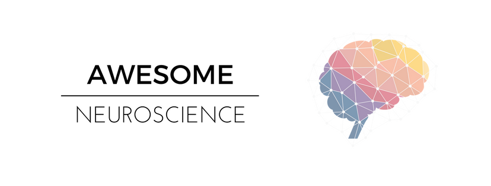

<!--  -->

> Curated list of awesome neuroscience libraries, software and any content related to the domain.

[Neuroscience](https://en.wikipedia.org/wiki/Neuroscience) is the study of how the nervous system develops, its structure, and what it does. Neuroscientists focus on the brain and its impact on behavior and cognitive functions. Traditionally, neuroscience has been seen as a branch of biology, but it has grown to encompass a wide range of interdisciplinary fields that work together toward elucidating brain function at multiple levels of investigation.

## Contents

- [Programming](#programming)
  - [Python](#python)
  - [Matlab](#matlab)
  - [C++](#c)
  - [JavaScript](#javascript)
- [Resources](#resources)
  - [Ebooks](#ebooks)
  - [Blogs](#blogs)
  - [MOOCs](#moocs)
  - [Communities](#communities)
  - [Newsletters](#newsletters)
  - [Miscellaneous](#miscellaneous)

## Programming
Software, libraries and frameworks for development purposes.

### Python

- [Nengo](https://github.com/nengo/nengo) - Library for creating and simulating large-scale brain models.
- [Nitime](https://github.com/nipy/nitime) - Timeseries analysis for neuroscience data.
- [Nilearn](https://github.com/nilearn/nilearn) - Module for performing statistical learning/machine learning on NeuroImaging data.
- [DIPY](https://github.com/nipy/dipy) - Toolbox for analysis of MR diffusion imaging.
- [MNE-Python](https://github.com/mne-tools/mne-python) - Community-driven software for processing time-resolved neural signals including electroencephalography (EEG) and magnetoencephalography (MEG).
- [NiBabel](https://github.com/nipy/nibabel) - Provides read and write access to some common medical and neuroimaging file formats.
- [PsychoPy](https://github.com/psychopy/psychopy) - Package for running psychology and neuroscience experiments. It allows for creating psychology stimuli in Python.
- [NuPic](https://github.com/numenta/nupic) - Numenta Platform for Intelligent Computing is an implementation of Hierarchical Temporal Memory (HTM), a theory of intelligence based strictly on the neuroscience of the neocortex.
- [Brian2](https://github.com/brian-team/brian2) - Free, open source simulator for spiking neural networks.
- [expyriment](https://github.com/expyriment/expyriment) - Platform-independent lightweight Python library for designing and conducting timing-critical behavioural and neuroimaging experiments.

### Matlab

- [FieldTrip](https://github.com/fieldtrip/fieldtrip) - Toolbox for MEG and EEG analysis.
- [Psychtoolbox-3](http://psychtoolbox.org/) -  Free set of Matlab and GNU Octave functions for vision and neuroscience research.

### C++

- [Brayns](https://github.com/BlueBrain/Brayns) - Minimalistic visualiser that can perform ray-traced rendering of neurons. Ray-tracing can help to highlight areas of neural circuits where cells touch each other and where synapses are being created leading to a better understanding of how individual cells and subsequently the brain functions.

### JavaScript
- [Brainbrowser](https://github.com/aces/brainbrowser) - Library exposing set of web-based 3D visualization tools primarily targetting neuroimaging.

### R
- [nat: NeuroAnatomy Toolbox](https://github.com/jefferis/nat) - Package for the (3D) visualisation and analysis of biological image data, especially tracings of single neurons.
- [brainGraph](https://github.com/cwatson/brainGraph) - Package for performing graph theory analyses of brain MRI data.

## Resources
Interesting resources related to neuroscience.

### Ebooks
- [Neuroscience Online](http://nba.uth.tmc.edu/neuroscience/m/index.htm) - Open-access electronic textbook and interactive courseware covering neuroscience in depth. Provided by the Department of Neurobiology and Anantomy at the University of Texas Medical School at Houston.
- [Computational Cognitive Neuroscience](https://grey.colorado.edu/CompCogNeuro/index.php/CCNBook/Main) - Text which provides an in-depth introduction to the main ideas in the computational cognitive neuroscience, a field which aims to understand the brain by using biologically based computational models.
- [Neuronal Dynamics](https://neuronaldynamics.epfl.ch) - Open-access electronic textbook that covers computational and theoretical neuroscience. Provided by École Polytechnique Fédérale de Lausanne (EPFL).

### Blogs

- [Neuroskeptic](http://blogs.discovermagazine.com/neuroskeptic/) - [Discover magazine](http://discovermagazine.com/)'s neuroscience blog which offers a look at the latest developments in neuroscience, psychiatry and psychology through a critical lens.
- [The Neurocritic](http://neurocritic.blogspot.in/) - Often critical takes on the most sensationalistic recent findings in Human Brain Imaging, Cognitive Neuroscience, and Psychopharmacology.
- [The scicurious brain](https://blogs.scientificamerican.com/scicurious-brain/) - Maintained by [Scientific American](https://blogs.scientificamerican.com/), this blog typically covers one research paper in a single entry.
- [Action Potential](http://blogs.nature.com/actionpotential) - Forum operated by neuroscience editors at the journal, Nature.

### MOOCs

[Massive Open Online Courses (MOOCs)](https://en.wikipedia.org/wiki/Massive_open_online_course) are free Web-based distance learning programs that are designed for the participation of large numbers of geographically dispersed students.
MOOCs may be patterned on a college or university course or may be less structured.

- [The Fundamentals of Neuroscience | Harvard & edX](https://www.mcb80x.org/) - Serves an introductory survery of topics in neuroscience and has no specific prerequisites, though some prior exposure to biology and/or chemistry can be helpful.
- [Introduction to Neuroscience | MIT OCW](https://ocw.mit.edu/courses/brain-and-cognitive-sciences/9-01-introduction-to-neuroscience-fall-2007/) - Introduction to the mammalian nervous system, with emphasis on the structure and function of the human brain.
- [Computational Neuroscience | Coursera](https://www.coursera.org/learn/computational-neuroscience) - Provides an introduction to basic computational methods for understanding what nervous systems do and for determining how they function.
- [Medical Neuroscience](https://www.coursera.org/learn/medical-neuroscience) - Explores the functional organization and neurophysiology of the human central nervous system, while providing a neurobiological framework for understanding human behavior.

### Communities
- [Quora](https://www.quora.com/topic/Neuroscience-1) - Neuroscience topic on Quora contains answers, often by experts, to questions ranging from basic to advanced.
- [Reddit](https://www.reddit.com/r/ScienceNetwork/comments/ptye0/link_tables/) - List of neuroscience, psychology and cognitive science subreddits.
- [StackExchange](https://psychology.stackexchange.com) - Psychology and neuroscience StackExchange site.

### Newsletters
- [On The Brain](http://neuro.hms.harvard.edu/harvard-mahoney-neuroscience-institute/hmni-newsletter) - Harvard Mahoney Neuroscience Institute's quarterly e-newsletter.
- [Comp-neuro](http://www.tnb.ua.ac.be/mailman/listinfo/comp-neuro) - A mailing list that is is intended to address the broad range of research approaches and issues involved in the general field of computational neuroscience. 

### Miscellaneous
- [Awesome Public Datasets - Neuroscience](https://github.com/awesomedata/awesome-public-datasets#neuroscience) - High-quality open neuroscience datasets.
- [McCulloch & Pitts Neural Net Simulator](https://justinmeiners.github.io/neural-nets-sim/) - Simulator for a historical computational model based on neurons.
- [ModelDB](https://senselab.med.yale.edu/ModelDB/default.cshtml) - Searchable database for computational neuroscience models.
- [NeuronDB](https://senselab.med.yale.edu/NeuronDB) - Searchable database for  of three types of neuronal properties: voltage gated conductances, neurotransmitter receptors, and neurotransmitter substances.
- [Neuroscience Mindmap](https://learn-anything.xyz/neuroscience) - Interactive mindmap containing curated resources for anyone interested in learning neuroscience.
- [neuroSummerSchools](https://github.com/PhABC/neuroSummerSchools) - List of summer (and seasonnal) summer schools in neuroscience and related fields.
- [Brain Matters](https://brainpodcast.com/) - Neuroscience podcast where real neuroscientists sit down and talk about the brain.

## Contribute

Contributions welcome! Read the [contribution guidelines](contributing.md) first.

## License

To the extent possible under law, [Akash Tandon](https://github.com/analyticalmonk) has waived all copyright and
related or neighboring rights to this work.
